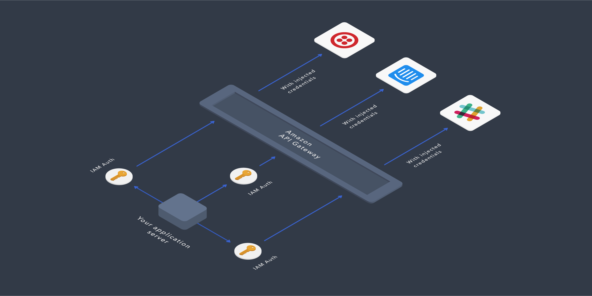
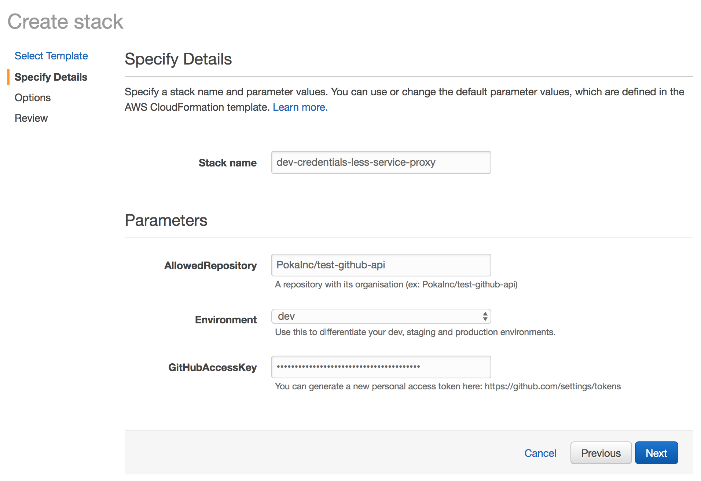
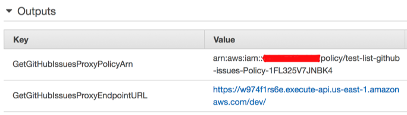

# _Credentials-less service access using an IAM authenticated API Gateway as a proxy™_

This was created as a proof-of-concept for the solution described in this [blog post](https://medium.com/p/308a6807d3ed) 
on the [Poka-Techblog](https://medium.com/poka-techblog). 

## Design Overview



## Provisioning
Create a new CloudFormation stack using the `list-github-issues-proxy.yml` template. Then, fill the parameters with 
the desired values.


This is what the outputs will looks like. 


Attach the managed policy to the role of the EC2 instance you plan to use. This policy also works on ECS containers and
AWS Lambdas. The URL is the one you'll need to call to access the desired service. 

## Using the proxy
This will depend on the language of your application. AWS [documentation](http://docs.aws.amazon.com/general/latest/gr/signature-v4-examples.html) 
describes the signing process for popular languages but this is still a tedious task. I strongly suggest that you use 
a signing library, here's the ones I've tested:

- https://github.com/DavidMuller/aws-requests-auth (Python)
- https://github.com/mhart/aws4 (Javascript)

Here's an example using Python:

```
import re
import urlparse

# To install the required packages run: 
# pip install requests boto3 aws-requests-auth
import requests
from aws_requests_auth.aws_auth import AWSRequestsAuth
from aws_requests_auth import boto_utils


# We got this URL from our provisioned stack's output. This should be passed as a configuration variable, 
# but since there's no secrets in there, you could hard-code this
GITHUB_PROXY_URL = 'https://w974f1rs6e.execute-api.us-east-1.amazonaws.com/dev/repos/PokaInc/test-github-api/issues'


def get_aws_auth(url):
    # These next variables are needed for the signing process
    api_gateway_netloc = urlparse.urlparse(url).netloc
    api_gateway_region = re.match(
        r"[a-z0-9]+\.execute-api\.(.+)\.amazonaws\.com",
        api_gateway_netloc
    ).group(1)
    
    return AWSRequestsAuth(
        aws_host=api_gateway_netloc,
        aws_region=api_gateway_region,
        aws_service='execute-api',
        # This is how we query the temporary credentials of the EC2 instance, as simple as that
        **boto_utils.get_credentials()
    )


list_issues_response = requests.get(
    url=GITHUB_PROXY_URL,
    auth=get_aws_auth(GITHUB_PROXY_URL)
)

print list_issues_response.json()

```

